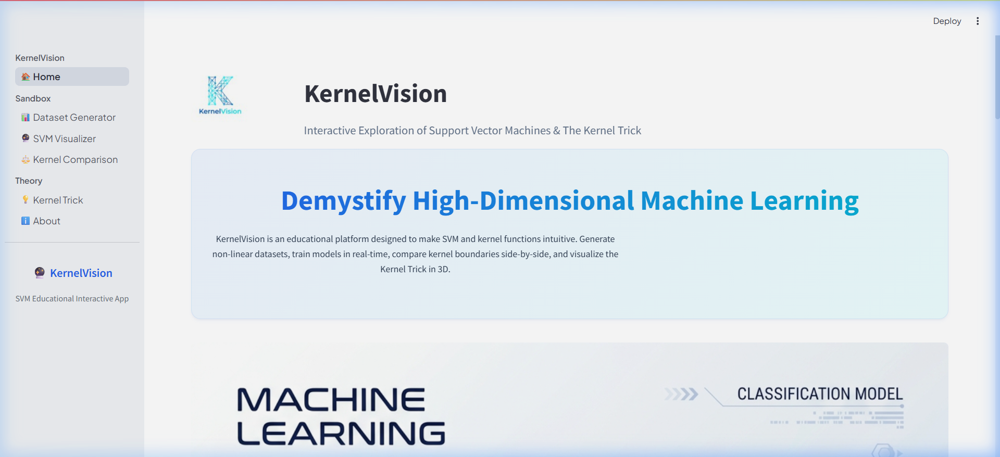
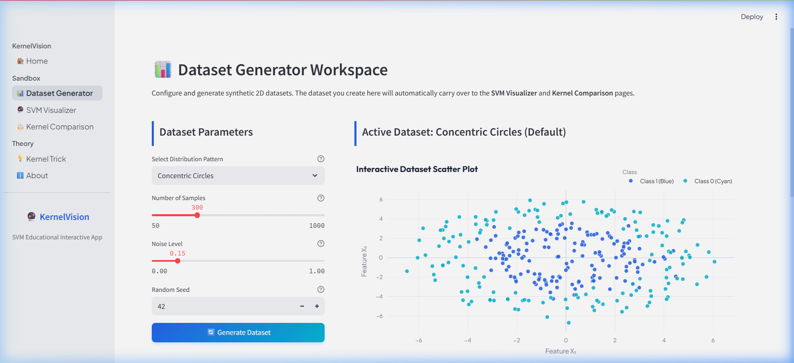
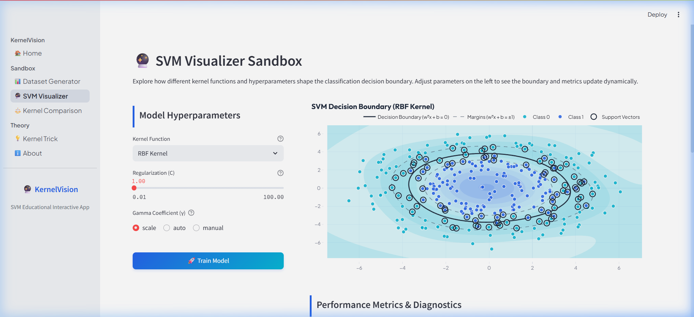

# 🔮 KernelVision

KernelVision is a professional, interactive educational Machine Learning web application designed to help students, developers, and beginners build a geometric and mathematical intuition for **Support Vector Machines (SVM)**, **Kernel Functions**, and the **Kernel Trick**.

Built using **Python, Streamlit, Scikit-learn, NumPy, Plotly, and Pandas**, KernelVision turns abstract equations into dynamic, interactive visualizations.

---

## 🌟 Features

* **Interactive Dataset Generator Workspace**: Generate common classification patterns like **Two Moons**, **Concentric Circles**, **Gaussian Blobs**, and **XOR Patterns**. Customize sizes, noise levels, and seeds with live stats and distribution ratios.
* **SVM Visualizer Sandbox**: Real-time training sandbox to test different kernels (`Linear`, `Polynomial`, `RBF`, `Sigmoid`) and dynamically observe decision boundaries, margins, and support vectors as you tune hyperparameters like `C`, `Gamma`, `Degree`, and `Coef0`.
* **Multi-Kernel Comparison**: Train all four kernels simultaneously on the active dataset in a uniform 2x2 coordinate layout. Compare performance and review a structured breakdown table explaining when to use each.
* **3D Kernel Trick Projection**: Explore a 3D projection of concentric circles using quadratic/RBF feature mapping ($z = x_1^2 + x_2^2$ or similarity meshes) split by a flat, translucent separating hyperplane.
* **Model & Report Exports**: Download trained `.pkl` models to use in production code, download classification metrics reports as text, and export Plotly charts.
* **Professional Theme**: Responsive, premium layout utilizing Outfit and Plus Jakarta Sans fonts, modern card containers, micro-hover animations, and an AI-inspired primary blue (`#2563EB`) and cyan (`#06B6D4`) palette.

---

## 📸 Screenshots

Here are screenshots of the KernelVision web application:

### 1. Home Page


### 2. Dataset Generator Workspace


### 3. SVM Visualizer Sandbox


---

## 🛠️ Tech Stack & Dependencies

* **Core Engine**: Python 3.13+
* **Frontend UI Framework**: Streamlit (v1.35.0+)
* **Machine Learning**: Scikit-Learn
* **Vector Operations & Analysis**: NumPy, Pandas, SciPy
* **Interactive Data Graphics**: Plotly (v5.0.0+)
* **Static Plot Layouts**: Matplotlib

---

## 📂 Project Structure

```
KernelVision/
│
├── app.py                  # Entrypoint, navigation router, and style injector
├── requirements.txt        # Third-party dependency definitions
├── README.md               # User manual and project documentation
├── .gitignore              # Git ignore rules
│
├── assets/                 # Custom styling and branding assets
│   ├── logo.png            # Application logo
│   ├── hero.png            # Conceptual landing header image
│   └── style.css           # Premium layout overrides and design system
│
├── pages/                  # Page modules for Streamlit navigation
│   ├── home.py             # Landing page, SVM overview, and workflow steps
│   ├── dataset.py          # Data generation and class balance stats
│   ├── visualizer.py       # Main model training and hyperparameter sandbox
│   ├── comparison.py       # 2x2 side-by-side kernel boundary grid
│   ├── kernel_trick.py     # Interactive 3D feature spaces and LaTeX math
│   └── about.py            # Tech stack descriptions and developer profiles
│
└── utils/                  # Reusable helper and math libraries
    ├── dataset_generator.py # Custom data cluster generators
    ├── svm_model.py        # SVC model training wrappers
    ├── plots.py            # Responsive Plotly scatter and contour drawers
    └── metrics.py          # Classification KPI functions
```

---

## 🚀 Installation & Quickstart

### 1. Clone the repository
```bash
git clone https://github.com/your-username/KernelVision.git
cd KernelVision
```

### 2. Set up virtual environment & install requirements
```bash
python -m venv .venv
# On Windows
.venv\Scripts\activate
# On MacOS/Linux
source .venv/bin/activate

pip install -r requirements.txt
```

### 3. Run the application
```bash
streamlit run app.py
```
Open [http://localhost:8501](http://localhost:8501) in your browser to start exploring.

---

## 💡 How It Works (The Math)

1. **Linear SVM**:
   $$K(\mathbf{x}, \mathbf{y}) = \mathbf{x}^T \mathbf{y}$$
2. **Polynomial Kernel**:
   $$K(\mathbf{x}, \mathbf{y}) = (\gamma \mathbf{x}^T \mathbf{y} + r)^d$$
3. **RBF (Gaussian) Kernel**:
   $$K(\mathbf{x}, \mathbf{y}) = \exp(-\gamma \|\mathbf{x} - \mathbf{y}\|^2)$$
4. **Sigmoid Kernel**:
   $$K(\mathbf{x}, \mathbf{y}) = \tanh(\gamma \mathbf{x}^T \mathbf{y} + r)$$

---

## 🔮 Future Enhancements
* Support CSV/Excel dataset uploads.
* Support Vector Regression (SVR) visualizations.
* Multi-class classification visualizations.

---

## 📄 License
This project is licensed under the MIT License - see the LICENSE file for details.
